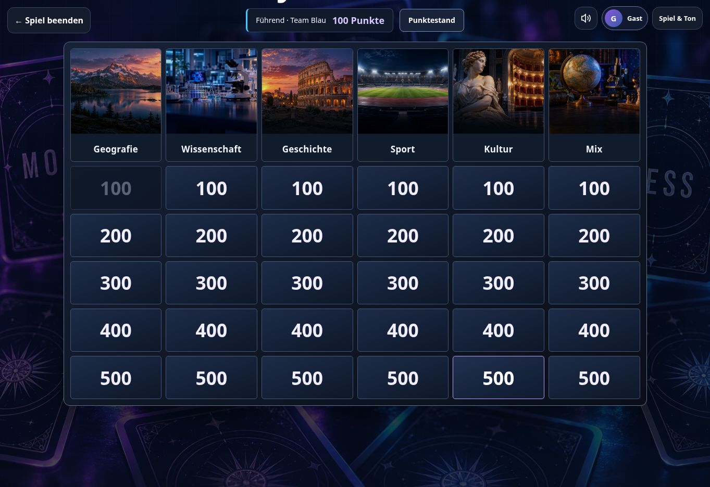

# Jeopardy Studio verification — 2026-10-04

Release: PR #103. Reviewed content: 439 clues, including 43 Transfers, 52 FIFA-Ratings and 30 Videospiele. Every final category has one distinct optimized image; all eight presets build a complete six-category, thirty-question board.

## Browser checks

- Published index loads expansion7 and Studio asset versions; all six Standard images load at 960px native width.
- Standings lists both existing teams and gives both rank 1 when tied. Answering Hamburg area with 755 gives Team Blau +100 and updates the compact leader display.
- Geography question background resolves the same geografie.webp used by its category header. Buzzing and answer entry remain functional.
- Simulated 390×844 viewport: 3 visible category headers and 15 cells; switching pages reveals Sport, Kultur and Mix. Document width is 390px, so there is no horizontal overflow.
- Simulated 844×390, 820×1180 and 1180×820 viewports: six columns; document widths equal their respective viewport widths.
- Native iOS/Safari keyboard behavior was not tested on a physical device.

## Automated checks

Full regression suite passed. Full DOM gameplay integration passed: image mapping, question backgrounds, score ranking, ties, negative scores, live updates, own/leader deduplication, nested native dialog and focus restoration. The final DOM check also clicks the actual selection button and verifies it keeps button semantics without nested notification buttons.

Live QA identified an existing focus manager treating #jeopSelect as a modal. It is a button within the board; excluding it from modal discovery preserves its accessible button semantics and stops unrelated notices being appended inside it. The actual question overlay remains a modal.

